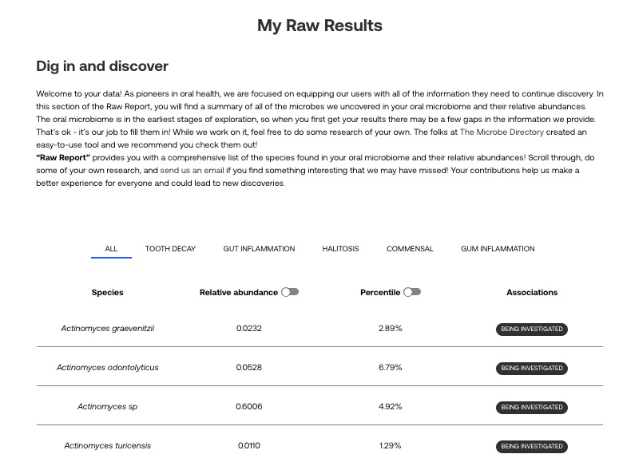

<!-- README.md is generated from README.Rmd. Please edit that file -->

```{r, include = FALSE}
knitr::opts_chunk$set(
  collapse = TRUE,
  comment = "#>",
  fig.path = "man/figures/README-",
  out.width = "100%"
)
```

# bristler

<!-- badges: start -->

<!-- badges: end -->

A simple package to help process raw data downloaded from the [Bristle Health](https://www.bristlehealth.com/) oral microbiome test.

## Installation

You can install the development version of bristler from [GitHub](https://github.com/) with:

``` r
# install.packages("devtools")
devtools::install_github("personalscience/bristler")
```

## Get your Bristle raw data

Log in to your Bristle account and switch the the [raw data](https://app.bristlehealth.com/samples/raw) view. You'll see something that looks like this:



From your desktop browser, you should be able to select the contents of the table with your mouse. Just click and drag every cell in the table, including the top header row.

Copy/paste that Bristle raw data into a Microsoft Excel sheet and save.

Read that data into R:

```{r example}
library(bristler)
library(tidyverse)

# example:  my_bristle_file <- file.path("path/to/my/local/xlsx/file")
my_bristle_file <- system.file("extdata", package = "bristler", "BristleHealthRaw.xlsx") # example

bristle_raw <- bristler::read_bristle_table(filepath= my_bristle_file)

```

Generate a simple frequency plot

```{r freq_plot}
bristler::plot_bristle_freq(bristle_raw)
```

or make a treemap

```{r plottree}
if(!require("treemap")) install.packages("treemap")

bristle_raw %>% treemap::treemap(dtf=., index = c("genus","species"),
                 vSize="abundance",
                 type = "categorical",
                 vColor = "genus",
                 position.legend = "none",
                 title = "My Mouth Microbes (Evening)")
```

Make fancier treemaps, like those needed for animations, like this:

```{r plotforanimation}
s1 <- bristler::treemap_of_sample(bristle_raw) %>% dplyr::mutate(label = "Oral")

s1 %>% dplyr::group_by(label) %>%
  ggplot(aes(xmin = x0, ymin = y0, xmax = x1, ymax = y1, mysample=label)) +
  # add fill and borders for groups and subgroups
  geom_rect(aes(fill = color, size = primary_group),
            show.legend = FALSE, color = "black", alpha = .3) +
  scale_fill_identity()

```
