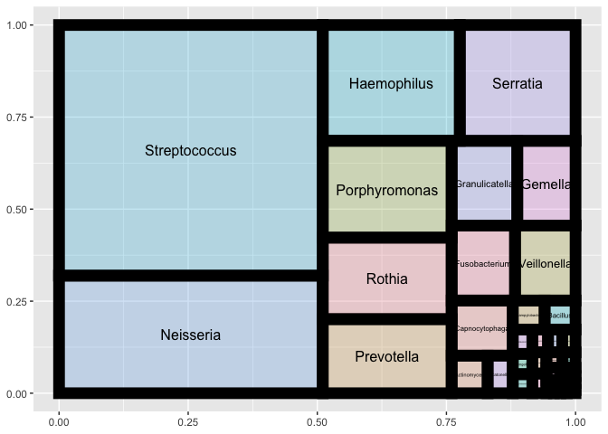

<!-- README.md is generated from README.Rmd. Please edit that file -->

# bristler

<!-- badges: start -->
<!-- badges: end -->

A simple package to help process raw data downloaded from the [Bristle
Health](https://www.bristlehealth.com/) oral microbiome test.

## Installation

You can install the development version of bristler from
[GitHub](https://github.com/) with:

``` r
# install.packages("devtools")
devtools::install_github("personalscience/bristler")
```

## Get your Bristle raw data

Log in to your Bristle account and switch the the [raw
data](https://app.bristlehealth.com/samples/raw) view. You’ll see
something that looks like this:


From your desktop browser, you should be able to select the contents of
the table with your mouse. Just click and drag every cell in the table,
including the top header row.

Copy/paste that Bristle raw data. You can either use it interactively
with the function `bristler::clip_bristle_table()` or save it to a
Microsoft Excel file and read with `bristler::read_bristle_table()`.

Read that data into R:

``` r
library(bristler)
library(tidyverse)
#> ── Attaching packages ─────────────────────────────────────── tidyverse 1.3.2 ──
#> ✔ ggplot2 3.3.6      ✔ purrr   0.3.4 
#> ✔ tibble  3.1.8      ✔ dplyr   1.0.10
#> ✔ tidyr   1.2.0      ✔ stringr 1.4.1 
#> ✔ readr   2.1.2      ✔ forcats 0.5.2 
#> ── Conflicts ────────────────────────────────────────── tidyverse_conflicts() ──
#> ✖ dplyr::filter() masks stats::filter()
#> ✖ dplyr::lag()    masks stats::lag()

# example:  my_bristle_file <- file.path("path/to/my/local/xlsx/file")
my_bristle_file <- system.file("extdata", package = "bristler", "BristleHealthRaw.xlsx") # example

bristle_raw <- bristler::read_bristle_table(filepath= my_bristle_file)

# bristle_raw <- bristler::clip_bristle_table()  # interactive method, from clipboard.
```

Generate a simple frequency plot

``` r
bristler::plot_bristle_freq(bristle_raw)
```


or make a treemap

``` r
if(!require("treemap")) install.packages("treemap")
#> Loading required package: treemap

bristle_raw %>% treemap::treemap(dtf=., index = c("genus","species"),
                 vSize="abundance",
                 type = "categorical",
                 vColor = "genus",
                 position.legend = "none",
                 title = "My Mouth Microbes (Evening)")
```


Make fancier treemaps, like those needed for animations, like this:

``` r
s1 %>% dplyr::group_by(label) %>%
  ggplot(aes(xmin = x0, ymin = y0, xmax = x1, ymax = y1, mysample=label)) +
  # add fill and borders for groups and subgroups
  geom_rect(aes(fill = color, size = primary_group),
            show.legend = FALSE, color = "black", alpha = .3) +
  scale_fill_identity()
```



## Other

The function `bristler::phyloseqize()` will convert your Bristle data
into a Phyloseq object.

See other examples at the
[personalscience/bristlehealth](https://github.com/personalscience/bristlehealth)
repo.
